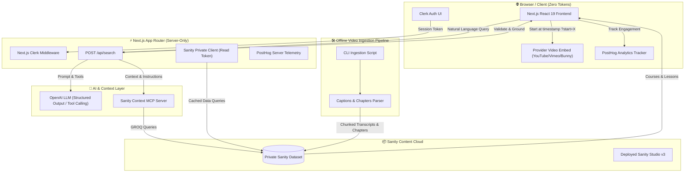

<div align="center">
  <br />
  <a href="https://youtu.be/8DfvwZ812dM" target="_blank">
    
  </a>
  <br />
  <br />

  <h1>⚡ Vertex | AI-Powered Learning Platform</h1>
  <p align="center">
    <strong>Instant, grounded natural language search across course video libraries — jumping directly to the exact second a concept is taught.</strong>
  </p>

  <div>
    
    
    
    
    
    
    
    
    
  </div>
</div>

---

## 📋 Table of Contents

1. [🌟 Overview](#-overview)
2. [💡 Why Vertex Beats Traditional Platforms](#-why-vertex-beats-traditional-platforms)
3. [🏗️ System Architecture & Data Flow](#️-system-architecture--data-flow)
4. [✨ Key Features](#-key-features)
5. [⚙️ Tech Stack Breakdown](#️-tech-stack-breakdown)
6. [📂 Project Structure](#-project-structure)
7. [🔐 Environment Variables](#-environment-variables)
8. [🚀 Getting Started & Setup Guide](#-getting-started--setup-guide)
9. [📹 Video Ingestion & Search Pipeline](#-video-ingestion--search-pipeline)
10. [🛡️ Security & Boundary Guardrails](#️-security--boundary-guardrails)
11. [📊 Telemetry & Analytics](#-telemetry--analytics)

---

## 🌟 Overview

**Vertex** is a production-grade, full-stack AI learning platform built with **Next.js 16 (App Router)**, **Sanity Studio v3**, **Sanity Context MCP**, **Clerk Authentication**, and **PostHog Analytics**.

Traditional e-learning platforms force students to scrub through hours of video or rely on generic, keyword-only search that returns full courses. **Vertex changes this fundamentally**: learners ask questions in natural, conversational language and receive **grounded, ranked result cards** linking directly to the **exact timestamp** inside the video player where that concept is explained.

Authors curate courses, modules, lessons, instructors, and rich Portable Text notes inside a standalone Sanity Studio, while an automated offline ingestion pipeline processes video transcripts into timestamped chunks.

---

## 💡 Why Vertex Beats Traditional Platforms

| Dimension | ❌ Traditional Learning Platforms (LMS) | ⚡ Vertex AI Learning Platform |
| :--- | :--- | :--- |
| **Search Mechanism** | Basic lexical keyword search matching only coarse course titles and summaries. | **Intelligent semantic search** powered by Sanity Context MCP + OpenAI generating targeted GROQ queries. |
| **Video Discovery** | "Go watch Lesson 4 (45 mins)" — forcing learners to manually scrub the timeline to find answers. | **Precision Deep-Linking**: Jumps directly to the exact second in the lesson video where the topic is taught. |
| **Search Output** | Vague, generic course links or chatty AI responses prone to hallucination. | **Strictly Grounded Result Cards**: Dual-format (Video Moments & Topic Lessons) validated against live CMS data. |
| **Content Architecture** | Monolithic, rigid database tables with bloated HTML storage. | **Structured Headless CMS** with Sanity: Modular schemas, rich Portable Text, decoupled presentation. |
| **Security & Privacy** | Tokens frequently leaked to client bundles or embedded CMS frames. | **Strict Zero-Leak Boundary**: Private datasets, server-only Sanity/Clerk/OpenAI tokens, zero client token exposure. |
| **Developer Experience** | Messy intertwined codebases with unstructured AI prompts. | **Dual Standalone Workspaces** (Web + Studio), TypeGen auto-typing, and documented agentic skills. |

---

## 🏗️ System Architecture & Data Flow

Vertex separates presentation, data storage, authentication, and AI context into isolated, highly scalable layers:



### Search Execution Lifecycle
1. **Query Dispatch**: The learner types a plain-English query into the search interface.
2. **Context Resolution**: The Next.js Route Handler (`/api/search`) connects to the **Sanity Context MCP** endpoint.
3. **GROQ Generation**: The LLM uses MCP schema metadata and tuning instructions to generate optimized GROQ queries across courses, lessons, and video timestamp chunks.
4. **Data Grounding**: Results are strictly grounded against live Sanity records — matching **chapters first**, falling back to **transcript chunks**, or identifying overarching lesson topics.
5. **Card Rendering**: Returns structured JSON rendered into responsive **Video Moment Cards** and **Lesson Cards**.
6. **Instant Playback**: Clicking a video result routes the learner to the lesson page with a `?start=<seconds>` parameter, starting playback immediately at that timestamp.

---

## ✨ Key Features

- 🔍 **Natural Language Video Search**: Discover exact moments inside lessons using conversational questions instead of rigid keywords.
- 🎯 **Deep-Linked Timestamp Playback**: Embedded YouTube, Vimeo, and Bunny players seek directly to the matched second upon arrival.
- 🗂️ **Hierarchical Course Catalog**: Fully structured Courses &rarr; Embedded Modules &rarr; Standalone Lesson Documents with clear learning outcomes and key takeaways.
- 📝 **Rich Portable Text Notes**: Interactive lesson companion notes, pro tips, external resources, and downloadable assets.
- 👤 **Instructor Profiles**: Dedicated instructor showcases linking all authored courses and expertise.
- 🔒 **Enterprise Authentication**: User sign-in, sign-up, and protected learning portals powered by **Clerk**.
- 📈 **Learner Progress Tracking**: Per-user lesson completion records and resume playback state.
- 📊 **Product Telemetry**: In-depth behavioral analytics powered by **PostHog** (search queries, video watch duration, completion events).
- 🎨 **Modern Aesthetics**: Built with Tailwind CSS v4, dark-mode ready glassmorphism accents, and responsive mobile-first layouts.

---

## ⚙️ Tech Stack Breakdown

### Frontend & Core
- **[Next.js 16 (App Router)](https://nextjs.org/)** — Full-stack React framework with Server Components and Route Handlers.
- **[React 19](https://react.dev/)** — Latest UI primitives and client interactivity.
- **[TypeScript](https://www.typescriptlang.org/)** — End-to-end static type safety with auto-generated Sanity TypeGen definitions.
- **[Tailwind CSS v4](https://tailwindcss.com/)** — Utility-first, performant modern styling.
- **[Lucide React](https://lucide.dev/)** — Crisp, lightweight icons.

### Content & AI Engine
- **[Sanity Studio v3](https://www.sanity.io/)** — Headless CMS managing structured schemas for courses, lessons, videos, and context.
- **[Sanity Context MCP](https://www.sanity.io/docs/context-mcp)** — Model Context Protocol server exposing CMS schema and content boundaries to LLMs.
- **[Vercel AI SDK (`ai`, `@ai-sdk/openai`, `@ai-sdk/mcp`)](https://sdk.vercel.ai/)** — Streamlined LLM execution and structured tool calling.
- **[Zod](https://zod.dev/)** — Strict runtime schema validation for API requests and LLM search responses.

### Auth & Telemetry
- **[Clerk](https://clerk.com/)** — User management, route middleware protection, and session handling.
- **[PostHog](https://posthog.com/)** — Product analytics tracking search actions, video plays, watch depth, and completions.

---

## 📂 Project Structure

Vertex uses a **dual standalone workspace** pattern to keep content authoring and web serving independently deployable:

```text
vertex-learning-platform/
├── app/                              # Next.js App Router
│   ├── (auth)/                       # Sign-in and sign-up auth routes (Clerk)
│   ├── api/                          # Server route handlers
│   │   ├── search/route.ts           # AI Search API (Sanity Context MCP + OpenAI)
│   │   └── progress/route.ts         # Learner progress write endpoint
│   ├── courses/                      # Course catalog & course detail pages
│   │   └── [slug]/page.tsx
│   ├── lessons/                      # Lesson viewer & video player
│   │   └── [slug]/page.tsx
│   ├── search/page.tsx               # Full-page structured search results UI
│   ├── layout.tsx                    # Root layout (ClerkProvider, PostHogProvider)
│   └── page.tsx                      # Landing homepage
├── components/                       # Shared UI components
│   ├── cards/                        # Course, lesson, and video result cards
│   ├── navigation/                   # Navbar, footer, user profile menu
│   └── player/                       # Video player embed with timestamp seeking
├── lib/                              # Core utilities & server modules
│   ├── analytics/                    # PostHog client & server helpers
│   ├── search/                       # MCP client, system prompts, grounding logic
│   │   ├── mcp.ts                    # Sanity Context MCP connector
│   │   ├── system-prompt.ts          # Agent search guidelines & rules
│   │   └── ground.ts                 # Search result validation & grounding
│   ├── portable-text.ts              # Custom Portable Text serializers
│   └── video.ts                      # Video URL parsing (YouTube, Vimeo, Bunny)
├── sanity/                           # Next.js Sanity client & query helpers
│   ├── lib/
│   │   ├── client.ts                 # Server-only private dataset client
│   │   ├── fetch.ts                  # Tagged cache fetch helper
│   │   └── queries.ts                # Optimized GROQ queries
│   └── sanity.types.ts               # Auto-generated TypeScript definitions
├── studio/                           # 📦 Standalone Sanity Studio Workspace
│   ├── schemaTypes/                  # Content schemas
│   │   ├── documents/                # course, lesson, instructor, category, video, agentContext
│   │   └── objects/                  # module, learningOutcome, resource, chapter, chunk
│   ├── scripts/                      # Offline ingestion & migration tooling
│   │   ├── ingest/                   # Video transcript & chapter ingestion CLI
│   │   │   ├── ingest-videos.mjs     # Multi-provider video ingestion runner
│   │   │   └── providers/            # YouTube, Vimeo, and Bunny caption extractors
│   │   ├── context/                  # Sanity Context document setup
│   │   └── seed/                     # Sample course & lesson seeding script
│   ├── sanity.config.ts              # Studio configuration & desk structure
│   └── package.json                  # Studio dependencies
├── prompts/                          # Implementation prompts & architectural specs
├── AGENTS.md                         # Project engineering rules & constraints
└── package.json                      # Next.js root dependencies & scripts
```

---

## 🔐 Environment Variables

Create a `.env.local` file in the root directory for the Next.js application, and a `.env` file in the `studio/` directory.

### Web Application (`.env.local`)

| Variable | Scope | Description |
| :--- | :--- | :--- |
| `NEXT_PUBLIC_SANITY_PROJECT_ID` | Public / Browser | Sanity Project ID from `sanity.io/manage`. |
| `NEXT_PUBLIC_SANITY_DATASET` | Public / Browser | Sanity dataset name (e.g. `production`). |
| `SANITY_API_READ_TOKEN` | **Server-Only** | Viewer/Read token for fetching private datasets. |
| `NEXT_PUBLIC_CLERK_PUBLISHABLE_KEY`| Public / Browser | Clerk Publishable Key from Clerk Dashboard. |
| `CLERK_SECRET_KEY` | **Server-Only** | Clerk Secret Key for backend middleware and auth. |
| `NEXT_PUBLIC_CLERK_SIGN_IN_URL` | Public / Browser | Sign-in route path (`/sign-in`). |
| `NEXT_PUBLIC_CLERK_SIGN_UP_URL` | Public / Browser | Sign-up route path (`/sign-up`). |
| `SANITY_CONTEXT_MCP_URL` | **Server-Only** | Sanity Context MCP HTTP endpoint. |
| `OPENAI_API_KEY` | **Server-Only** | OpenAI API key powering the search agent. |
| `NEXT_PUBLIC_POSTHOG_KEY` | Public / Browser | PostHog public project API key. |
| `NEXT_PUBLIC_POSTHOG_HOST` | Public / Browser | PostHog host URL (`https://us.i.posthog.com` or EU). |

### Studio Workspace (`studio/.env`)

| Variable | Scope | Description |
| :--- | :--- | :--- |
| `SANITY_STUDIO_PROJECT_ID` | Studio Client | Sanity Project ID for the Studio dashboard. |
| `SANITY_STUDIO_DATASET` | Studio Client | Dataset targeted by the Studio (e.g. `production`). |

---

## 🚀 Getting Started & Setup Guide

### 1. Prerequisites
Ensure you have the following installed:
- [Node.js](https://nodejs.org/) (v20.x or later)
- [npm](https://www.npmjs.com/) or [pnpm](https://pnpm.io/)
- [Git](https://git-scm.com/)

### 2. Clone the Repository
```bash
git clone https://github.com/your-username/vertex-learning-platform.git
cd vertex-learning-platform
```

### 3. Install Dependencies
Install dependencies for both the Next.js web application and the Sanity Studio:

```bash
# Install root (Next.js) dependencies
npm install

#Deploy this First. 
cd studio
npx sanity login
npx sanity deploy
```

**Set Up Environment Variables**

Create a new file named `.env` in the root of your project and add the following content:

```env
NEXT_PUBLIC_SANITY_DATASET=
NEXT_PUBLIC_SANITY_PROJECT_ID=

# Clerk — add your keys from dashboard.clerk.com > API keys.
# CLERK_SECRET_KEY is server only: never prefix it with NEXT_PUBLIC_.
NEXT_PUBLIC_CLERK_PUBLISHABLE_KEY=
CLERK_SECRET_KEY=

NEXT_PUBLIC_CLERK_SIGN_IN_URL=/sign-in
NEXT_PUBLIC_CLERK_SIGN_UP_URL=/sign-up
NEXT_PUBLIC_CLERK_SIGN_IN_FALLBACK_REDIRECT_URL=/
NEXT_PUBLIC_CLERK_SIGN_UP_FALLBACK_REDIRECT_URL=/

# Server-only. Paste a Viewer token from sanity.io/manage > API > Tokens.
SANITY_API_READ_TOKEN=

# Sanity Context MCP — the search agent's connection (slug applies the
# sanity.agentContext document). Server only.
SANITY_CONTEXT_MCP_URL=

# OpenAI — powers the search agent. Server only. Paste your key here.
OPENAI_API_KEY=
```

Replace the placeholder values with your real credentials. You can get these by signing up at: [**Clerk**](https://jsm.dev/vertex-clerk), [**Sanity**](https://jsm.dev/vertex-sanity), [**PostHog**](https://jsm.dev/vertex-posthog).

**Running the Project**

```bash
npm run dev
```

Open [http://localhost:3000](http://localhost:3000) in your browser to explore Vertex.

---

## 📹 Video Ingestion & Search Pipeline

Vertex treats transcripts and table of contents as structured data rather than raw text blobs.

### Ingesting Videos
To process a video (YouTube, Vimeo, or Bunny) into chunked transcript pieces and chapters:

```bash
# Ingest transcripts from configured video URLs in Sanity
node studio/scripts/ingest/ingest-videos.mjs
```

### How Video Chunks are Stored:
```json
{
  "_type": "video",
  "id": "video-youtube-abc123xyz",
  "url": "https://www.youtube.com/watch?v=abc123xyz",
  "chapters": [
    { "startSeconds": 0, "label": "Introduction to Server Actions" },
    { "startSeconds": 245, "label": "Optimistic UI Mutations" }
  ],
  "chunks": [
    { "startSeconds": 245, "text": "When building optimistic updates in React 19..." },
    { "startSeconds": 275, "text": "useOptimistic takes the current state and a reducer..." }
  ]
}
```

---

## 🛡️ Security & Boundary Guardrails

Vertex adheres to strict architectural security boundaries:

- 🔒 **Zero Token Leakage**: The browser bundle never contains `SANITY_API_READ_TOKEN`, `CLERK_SECRET_KEY`, `OPENAI_API_KEY`, or `SANITY_CONTEXT_MCP_URL`.
- 🛡️ **Server-Side AI Resolution**: All MCP queries and OpenAI completions are executed strictly within Next.js Route Handlers.
- 🗄️ **Private Datasets**: Sanity datasets are private by default; data fetching occurs server-side with cached read tokens.
- ✍️ **Protected Writes**: Learner progress records can only be mutated through authenticated server endpoints verified by Clerk user IDs.

---

## 📊 Telemetry & Analytics

PostHog is integrated at critical engagement points to deliver clear learning metrics:

- 👁️ **Page Views**: Catalog navigation, course previews, and lesson loads.
- 🔎 **Search Queries**: Query terms, filter criteria, click-through rates, and zero-result queries.
- ▶️ **Video Telemetry**: Video start, seek events, milestone watch depth (25%, 50%, 75%, 100%).
- 🏆 **Lesson Completions**: Automated completion triggers updating learner progress.

---

<div align="center">
  <p>Built with ❤️ using Next.js, Sanity, Clerk, and PostHog.</p>
</div>
