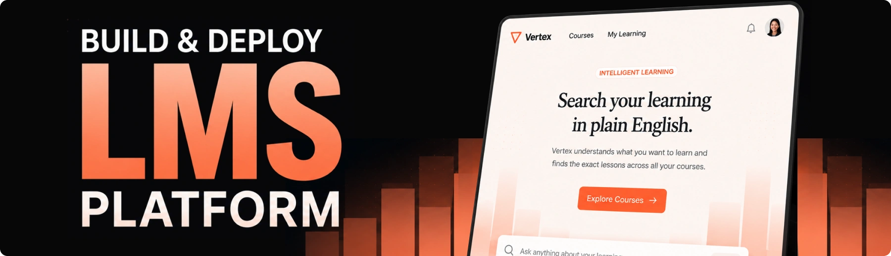

<div align="center">
  <br />
    <a href="https://youtu.be/8DfvwZ812dM" target="_blank">
      
    </a>
  <br />

  <div>
    
    
    
    <br/>
    
    

    
    
  </div>

  <h3 align="center">Vertex | AI-Powered Learning Platform</h3>

</div>

## 📋 <a name="table">Table of Contents</a>

1. ✨ [Introduction](#introduction)
2. ⚙️ [Tech Stack](#tech-stack)
3. 🔋 [Features](#features)
4. 🤸 [Quick Start](#quick-start)
5. 🔗 [Assets](#links)
6. 🚀 [More](#more)

## <a name="introduction">✨ Introduction</a>

Vertex is a production-ready full-stack learning platform designed to revolutionize video content discovery and course administration. On the learner side, users can search video lessons using natural language queries and immediately jump to the exact second where a topic is explained. On the administrative side, authors access a comprehensive management dashboard to curate courses, structure modules, and publish instructor profiles.

Beyond its end-user functionality, Vertex showcases a structured agentic engineering workflow. By utilizing custom agent skills, project rules, and context files, developers can stay in control as architects while leveraging AI coding assistants to build complex features with security, speed, and scalability.

## <a name="tech-stack">⚙️ Tech Stack</a>

- **[Next.js](https://nextjs.org/)** is a full-stack React framework providing server-side rendering, static generation, and efficient routing. It serves as the foundation for Vertex, powering both the learner-facing application and the administrative dashboard.

- **[TypeScript](https://www.typescriptlang.org/)** is a strongly typed superset of JavaScript that adds static type definitions to your codebase. It ensures end-to-end type safety across the application, reducing runtime errors and improving developer experience during scaling.

- **[Tailwind CSS](https://tailwindcss.com/)** is a utility-first CSS framework designed for rapid and modern interface design. It handles the styling across all components, delivering clean, responsive UI layouts without bulky standard stylesheets.

- **[Sanity](https://jsm.dev/vertex-sanity)** is a flexible headless content management platform that manages structured schema models. It stores and delivers course content, module hierarchies, video metadata, and instructor profiles through real-time APIs.

- **[Clerk](https://jsm.dev/vertex-clerk)** is an enterprise user management and authentication system for React applications. It handles secure user sign-ups, session persistence, and role-based access controls to separate administrative workflows from learner accounts.

- **[PostHog](https://jsm.dev/vertex-posthog)** is an all-in-one product analytics suite that tracks user interactions and feature usage. It monitors search queries, video lesson interactions, and learner engagement across the platform.

- **[CodeRabbit](https://jsm.dev/vertex-rabbit)** is an AI-powered code review platform that automates pull request analysis. It identifies potential architectural issues and enforces consistency across every automated build.

## <a name="features">🔋 Features</a>

👉 **Intelligent Video Search**: Search video content using plain-English natural language queries to seek directly to the exact second a topic is discussed.

👉 **Author Admin Dashboard**: Comprehensive management interface for course creators to construct modules, arrange lessons, and manage instructor profiles.

👉 **Role-Based Authentication**: Secure authentication powered by Clerk with route protection separating student learning portals from admin features.

👉 **Headless CMS Integration**: Real-time content management powered by Sanity for dynamic catalog management and video metadata updates.

👉 **Product Analytics**: Integrated user tracking and event telemetry powered by PostHog to analyze user behavior and engagement metrics.

👉 **Agentic Engineering Workflow**: Built using custom agent skills, context files, and explicit project rules to maintain structured development without prompt chaos.

And many more, including code architecture and reusability.

## <a name="quick-start">🤸 Quick Start</a>

Follow these steps to set up the project locally on your machine.

**Prerequisites**

Make sure you have the following installed on your machine:

- [Git](https://git-scm.com/)
- [Node.js](https://nodejs.org/en)
- [npm](https://www.npmjs.com/) (Node Package Manager)

**Cloning the Repository**

```bash
git clone https://github.com/jsmastery-pro/vertex-learning-platform.git
cd vertex-learning-platform
```

**Installation**

Install the project dependencies using npm:

```bash
npm install
```

**Set Up Environment Variables**

Create a new file named `.env` in the root of your project and add the following content:

```env
NEXT_PUBLIC_SANITY_DATASET=
NEXT_PUBLIC_SANITY_PROJECT_ID=

# Clerk — add your keys from dashboard.clerk.com > API keys.
# CLERK_SECRET_KEY is server only: never prefix it with NEXT_PUBLIC_.
NEXT_PUBLIC_CLERK_PUBLISHABLE_KEY=
CLERK_SECRET_KEY=

NEXT_PUBLIC_CLERK_SIGN_IN_URL=/sign-in
NEXT_PUBLIC_CLERK_SIGN_UP_URL=/sign-up
NEXT_PUBLIC_CLERK_SIGN_IN_FALLBACK_REDIRECT_URL=/
NEXT_PUBLIC_CLERK_SIGN_UP_FALLBACK_REDIRECT_URL=/

# Server-only. Paste a Viewer token from sanity.io/manage > API > Tokens.
SANITY_API_READ_TOKEN=

# Sanity Context MCP — the search agent's connection (slug applies the
# sanity.agentContext document). Server only.
SANITY_CONTEXT_MCP_URL=

# OpenAI — powers the search agent. Server only. Paste your key here.
OPENAI_API_KEY=
```

Replace the placeholder values with your real credentials. You can get these by signing up at: [**Clerk**](https://jsm.dev/vertex-clerk), [**Sanity**](https://jsm.dev/vertex-sanity), [**PostHog**](https://jsm.dev/vertex-posthog).

**Running the Project**

```bash
npm run dev
```

Open [http://localhost:3000](http://localhost:3000) in your browser to view the project.


